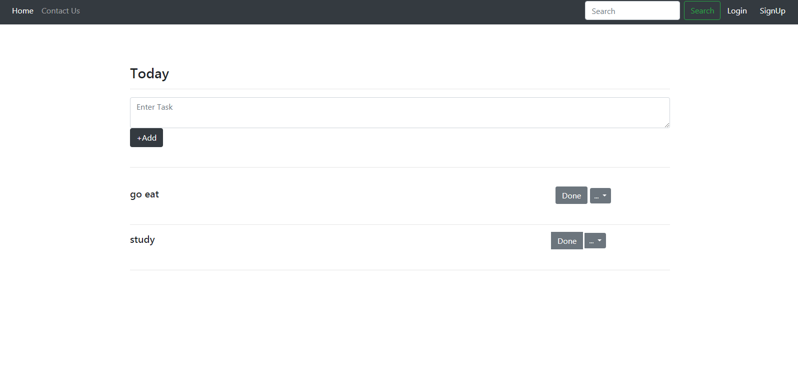

# To-do List Web-app

It is a simple Web application ,that can be used to pal your day and help you keep track of your pending tasks. 

# How to Use it
 
 As it is a basic application , you will see a text area to type in your task and add it to the your list.once,you are done with the task ,just click the "Done button" and the task will be removed from your list.
 
 # Functionalities
 
Update : If by mistake you have written somethig wrong or you want to edit your task . You can simply press the Update button.
Delete : If you for some reason no longer need to the task ,you can just delete it.

# Future Scope
I wish to add the functionality of sign up ,so that a user can login once he sign-up.

